# Smart City Environmental Monitoring

[](https://github.com/balvindersingh07/smartcity/actions/workflows/ci-cd.yml)

**Live repo:** [github.com/balvindersingh07/smartcity](https://github.com/balvindersingh07/smartcity)

Production-style **distributed system** for real-time environmental sensor data: **microservices** (Python / FastAPI), **Kafka** streaming, **PostgreSQL**, **React** dashboard, **Docker**, **Kubernetes (AKS)** on **Azure**, with **GitHub Actions** CI/CD and images on **GHCR**.

This file is the **GitHub repository home page** (root `README.md`). Application code lives under [`smart-city/`](smart-city/).

---

## Repository on GitHub

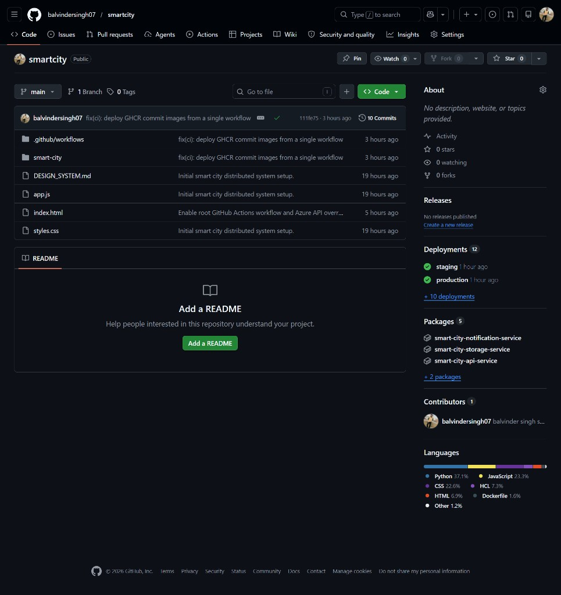

---

## Project banner


---

## Tech stack

| Layer | Technologies |
|------|----------------|
| Microservices | Python, FastAPI |
| Frontend | React, Vite |
| Messaging | Apache Kafka (Redpanda in cluster) |
| Data | PostgreSQL |
| Cloud | Azure (AKS, Container Registry, budgets, Application Insights) |
| IaC | Terraform (HCL) |
| CI/CD | GitHub Actions, GHCR |

---

## Architecture (diagrams)

### Microservices


### Data flow


### CI/CD and Azure


---

## Screenshots

### Environmental monitoring dashboard (UI)

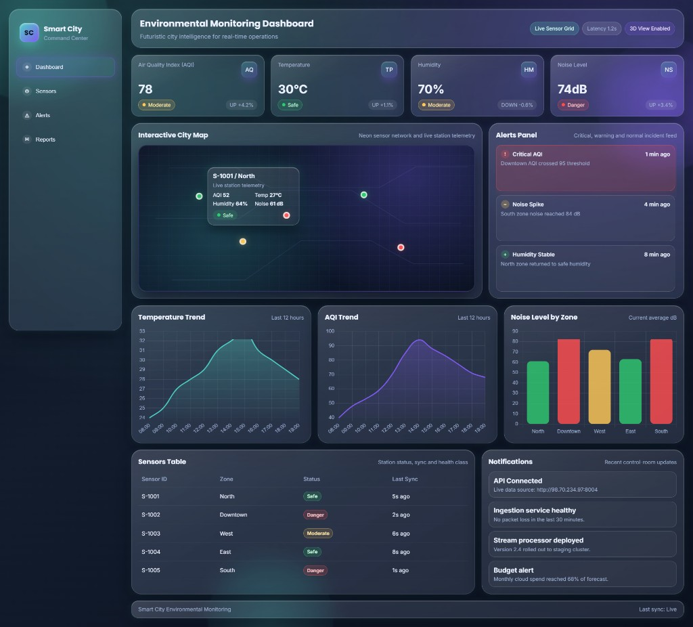

### CI/CD: successful pipeline (staging then production)

Tests, Docker build, push to GHCR, deploy to AKS staging, then production.

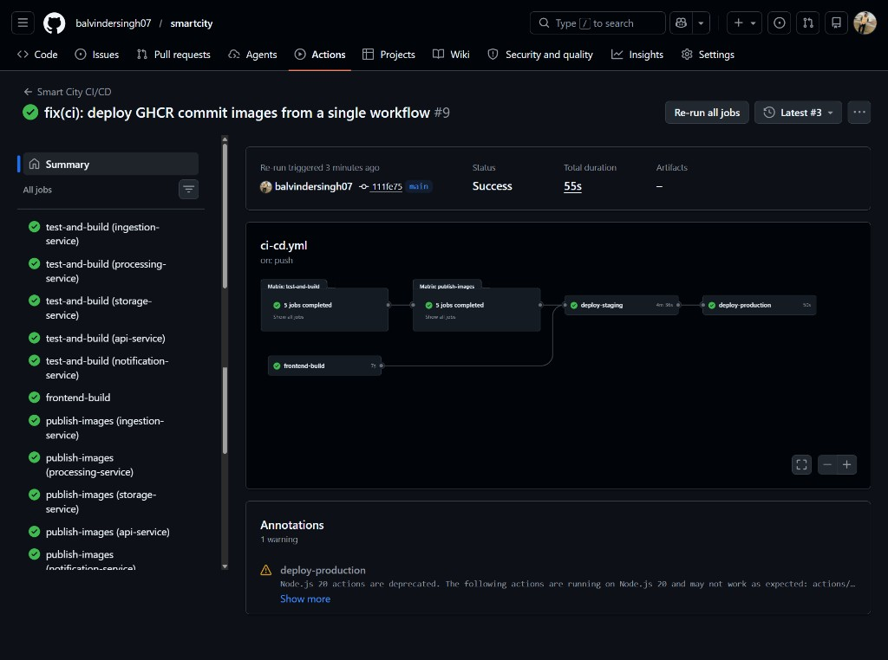

### Azure: staging resources (AKS, ACR, networking)

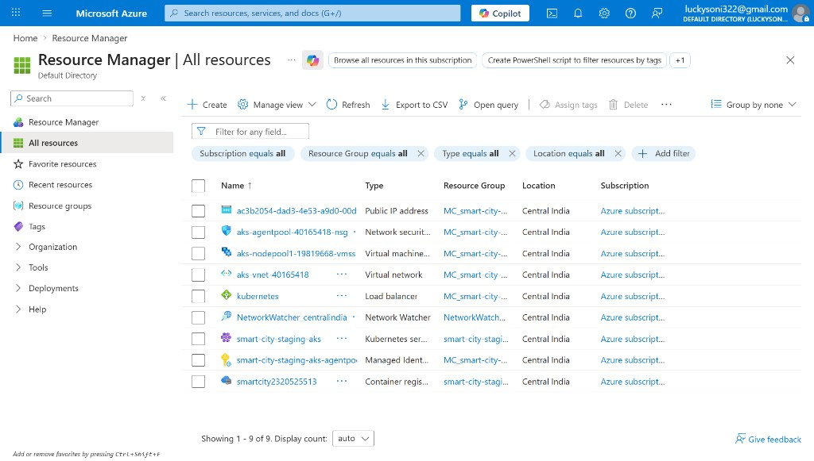

### Azure: Application Insights (monitoring)

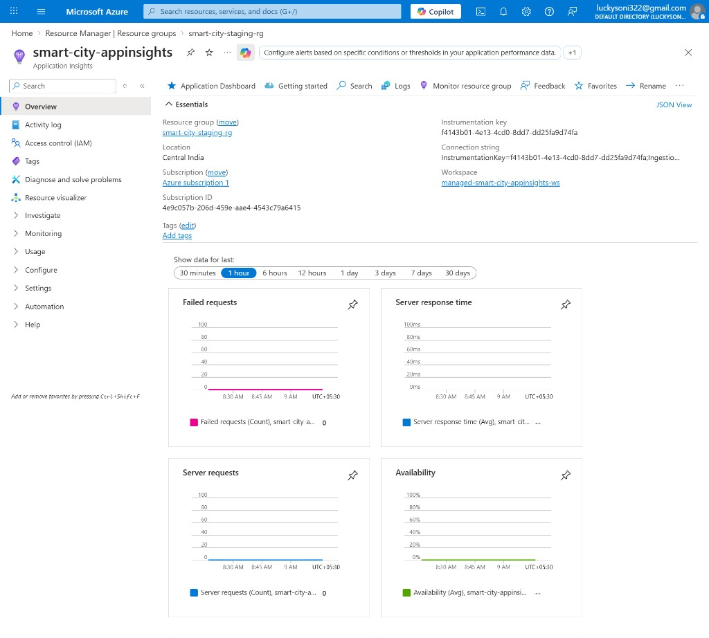

### Azure: monthly budget (cost control)

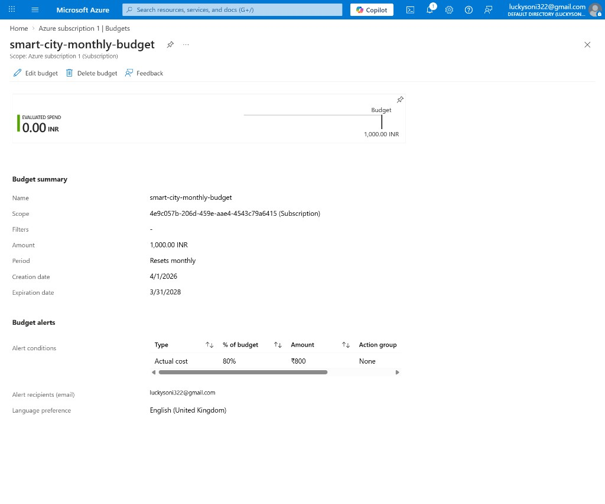

### GitHub Actions: workflow run history

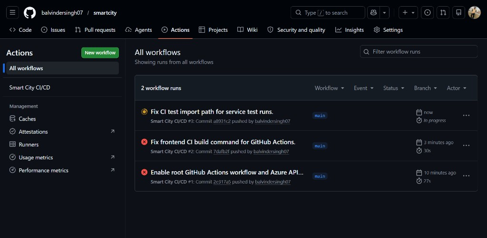

<details>
<summary><b>CI/CD troubleshooting (historical)</b> - click to expand failure screenshots</summary>

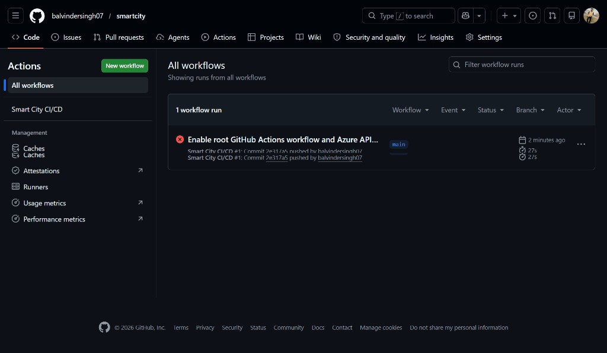

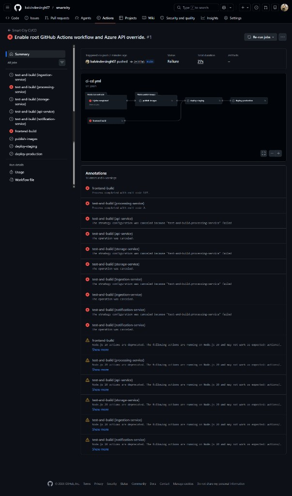

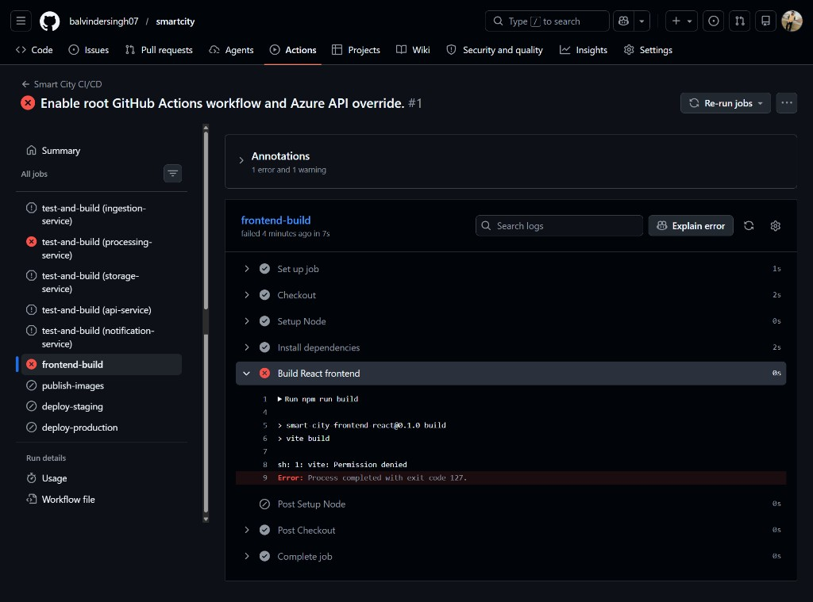

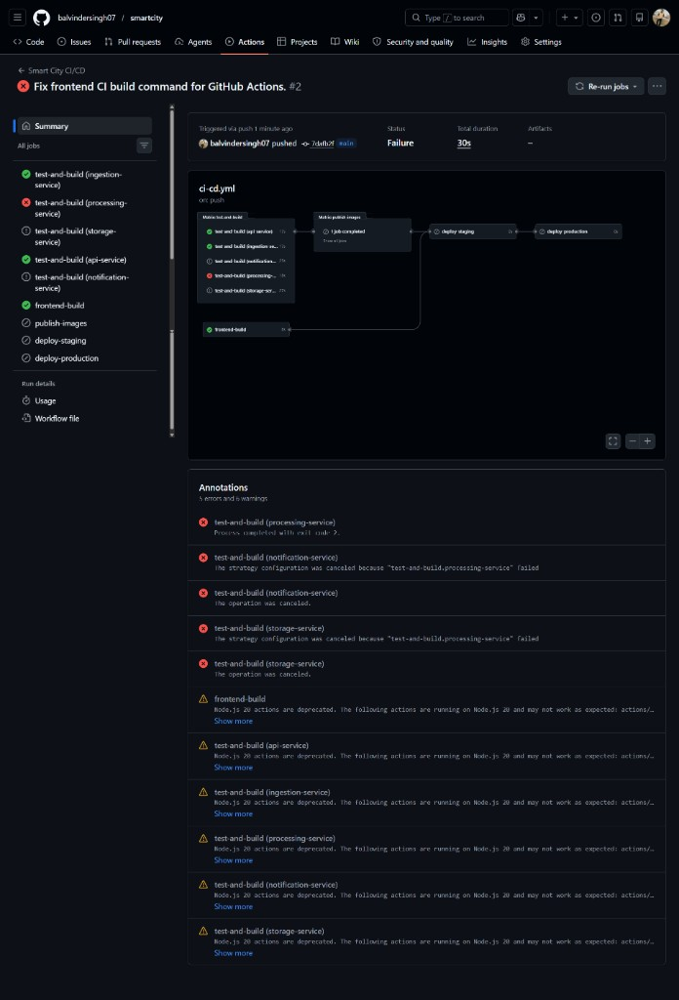

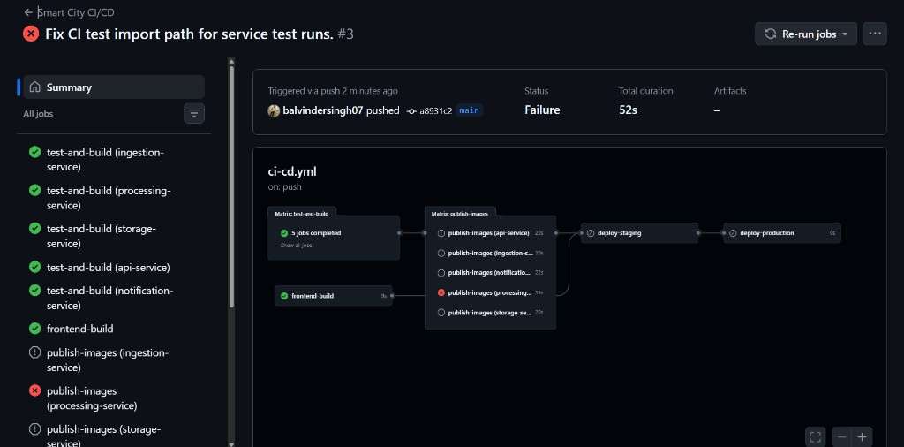

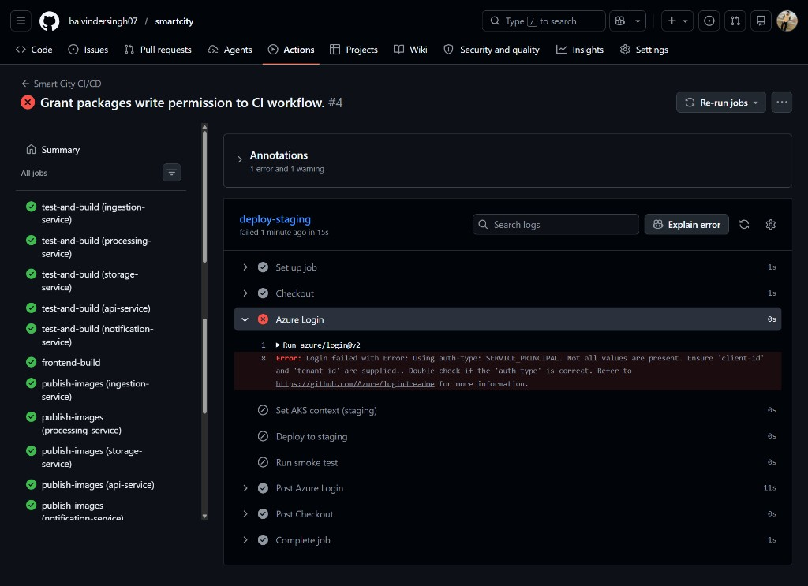

</details>

---

## Features

- **Services:** ingestion, processing, storage, API, notification (FastAPI)
- **Streaming:** Kafka topics for sensor events and downstream processing
- **Storage:** PostgreSQL (metadata and sensor time-series data)
- **Frontend:** React dashboard (`smart-city/frontend-react`)
- **Kubernetes:** manifests under `smart-city/kubernetes/` (deps, network policies, HPA, ingress)
- **CI/CD:** on push to `main`, build and push `ghcr.io/<owner>/smart-city-<service>:<sha>`, deploy to staging then production AKS

---

## Repository layout

```text
.
??? .github/workflows/ci-cd.yml
??? docs/images/                 # Diagrams (SVG) and screenshots (PNG) for this README
??? README.md                    # This file (GitHub home page)
??? DESIGN_SYSTEM.md
??? app.js, index.html, styles.css
??? smart-city/
?   ??? README.md                # Quick start inside the app folder
?   ??? docker-compose.yml
?   ??? services/                # microservices
?   ??? frontend-react/
?   ??? kubernetes/
?   ??? terraform/
?   ??? kafka/
?   ??? ci-cd/
??? submission/                  # Capstone DOCX generator (optional)
```

Folder-only quick reference: **[smart-city/README.md](smart-city/README.md)**

---

## Quick start (local)

```bash
cd smart-city
docker compose up --build
```

| Service | Swagger |
|---------|---------|
| Ingestion | http://localhost:8001/docs |
| Processing | http://localhost:8002/docs |
| Storage | http://localhost:8003/docs |
| API | http://localhost:8004/docs |
| Notification | http://localhost:8005/docs |

Frontend dev:

```bash
cd smart-city/frontend-react
npm install
npm run dev
```

Example ingest:

```bash
curl -X POST http://localhost:8001/ingest \
  -H "Content-Type: application/json" \
  -d '{"sensor_id":"sensor-001","type":"temperature","value":31.5,"timestamp":"2026-04-15T10:00:00Z","location_id":"zone-a"}'
```

---

## Kubernetes (AKS) and CI/CD

Workflow: **[`.github/workflows/ci-cd.yml`](.github/workflows/ci-cd.yml)**

- Pushes to `main` run tests, build images, publish to GHCR, then `kubectl apply` and `kubectl set image` for staging and production.
- Manifests: `smart-city/kubernetes/`

**GitHub secrets (typical):**

| Secret | Purpose |
|--------|---------|
| `AZURE_CREDENTIALS` | Service principal JSON for `azure/login` |
| `AKS_RG_STAGING` | Staging resource group |
| `AKS_CLUSTER_STAGING` | Staging cluster name |
| `AKS_RG_PROD` | Production resource group |
| `AKS_CLUSTER_PROD` | Production cluster name |

Use GitHub **Environments** `staging` and `production` for approvals and secrets.

More: [smart-city/kubernetes/README.md](smart-city/kubernetes/README.md), [smart-city/ci-cd/README.md](smart-city/ci-cd/README.md)

---

## Terraform (Azure)

```bash
cd smart-city/terraform
terraform init
terraform plan -var-file=prod.tfvars -out tfplan
terraform apply tfplan
```

See [smart-city/terraform/README.md](smart-city/terraform/README.md).

---

## Security and monitoring

- Health and Prometheus-style metrics on services where implemented
- Kubernetes RBAC and NetworkPolicies
- Optional Log Analytics / Application Insights via Terraform

---

## Capstone report (DOCX)

```bash
pip install python-docx
python submission/generate_capstone_report_docx.py
```

Output: `submission/Smart_City_Environmental_Monitoring_Capstone_Report.docx`

---

## License

Specify your license (e.g. MIT) here if the repository is public.
